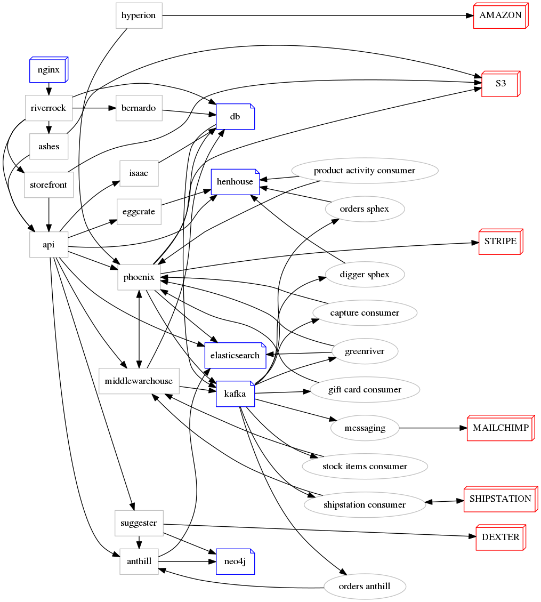
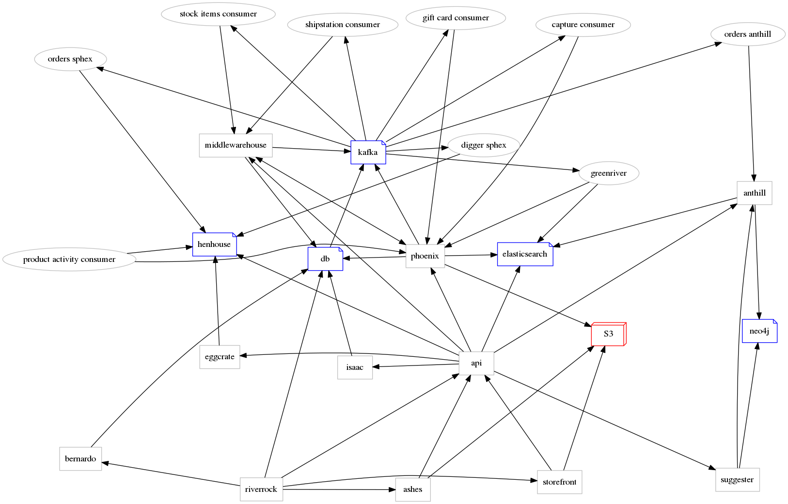

# Highlander

[](https://buildkite.com/foxcommerce/developer-appliance-gce)

Highlander is the brand-spanking-new FoxCommerce mono-repo.

Please proceed to [wiki](https://github.com/FoxComm/highlander/wiki) for more detailed info.

## Development Environment

The simplest way to get started is setup a personal developer appliance in Google Cloud that runs the entire system. It's really easy, though you'll probably want to grab a coffee the first time you run it - it has a lot to do!

### Install Prerequisites

- [Ansible](https://ansible.com) 2.2.x

### Google Compute VM

1. Ask one of DevOps guys for Ansible Vault password and OpenVPN keys + client configuration.

2. [Generate your SSH key](https://help.github.com/articles/generating-a-new-ssh-key-and-adding-it-to-the-ssh-agent/) for GCE and put the public key to [project metadata](https://console.cloud.google.com/compute/metadata/sshKeys?project=foxcomm-staging).

3. [Generate Google service account key](https://cloud.google.com/storage/docs/authentication#generating-a-private-key) and download it in JSON format to your machine.

4. Run `.env.local` generator, required for Vagrant. You'll be prompted for you corporate e-mail and SSH/JSON key locations.

    ```
    $ make dotenv
    ```

5. Pre-configure Ansible by running:

    ```
    $ make prepare
    ```

6. You're ready to spin up the machine! Do it by running:

    ```
    $ make up
    ```

#### Deploying Custom Branches

Please refer to related [wiki page](https://github.com/FoxComm/highlander/wiki/Deploying-Custom-Branches) for more information.

## FoxCommerce Software Relationships

Logical relationships between services and software.



Physical model.


