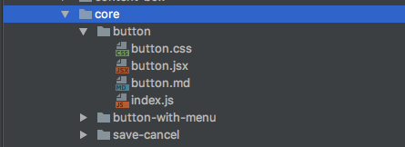

# Developing new components

## Core components

Core components are building blocks of the app. It is reusable components that are used all over the app,
e.g. `Button`, `Dropdown`, `ConfirmationModal`, etc.

### Files structure

Core components are located in `src/components/core` directory.
All files related to core component(jsx/css/md) should reside in separate directory named after component in kebab-case.


#### index.js

`index.js` file should reside in the directory and should export public components(s) from main component file.
```js
export default from './button';
```

#### component.jsx

`component.jsx` file should contain main js code.

### Flow Type
All components should be typechecked with flow.
It should have `Props` and `State` definitions(in case components accepts it).

```js
// src/components/core/component/component.jsx
type Props = {
  // Title string to be shown
  title: string,
};

type State = {
  // If title string is opened or not
  opened: boolean,
};

// class component declaration
class CoreComponent extends Component {
  props: Props;

  state: State = {
    opened: true,
  };
}

// functional component declaration
function CoreComponent(props: Props) { // or function CoreComponent({ title }: Props) { ...
  // jsx code
};
```
All props flow definition should be accompanied with comments that would be used by styleguidist to generate docs.

### Import blocks comments

Import block should be grouped and commented accordingly.
The order of import block should be the following: libs, redux, components, types, styles.
Imported modules from `node_modules` should preceed local modules.

```js
/* @flow */

// libs
import classNames from 'classnames';
import { get, find } from 'lodas';
import React, { Component } from 'react';

// redux
import { fetch } from 'modules/orders';

// components
import { Link } from 'react-router';
import Order from 'components/orders/details';

// types
import type { Order } from 'modules/orders';

// styles
import s from './orders.css';

...
```

### Styles

CSS should be written with usage of css-modules and importing styles object in `s`-named variable.

```js
// libs
import classNames from 'classnames';

// styles
import s from './component.css';

type Props = {
  title: string,
  className?: string,
};

export default ({ title, className = '' }: Props) => (
  <div className={classNames(s.title, className)}>{title}</div>
);
```

[More on styles](styles.md)

### Styleguidist

You can run styleguidist to work with new components that supports isolated mode and hmr that simplifies development.
You can start styleguidist server with `yarn run styleguid`. It will start on `localhost:6060`.

### Usage

Core componentes can be imported as `components/core/component-name`.

```js
import Button from 'components/core/button'

```

Import with absolute path(relative to `src` directory) is possible here due to
[babel-plugin-module-resolver](https://www.npmjs.com/package/babel-plugin-module-resolver) usage.

```json
{
  "plugins": [
    ["module-resolver", {
      "root": ["./src"]
    }]
  ]
}
```

