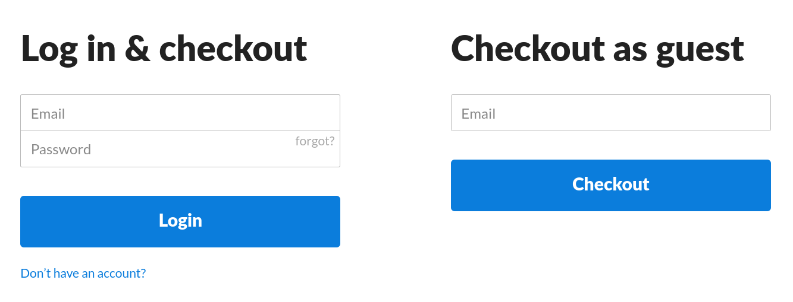
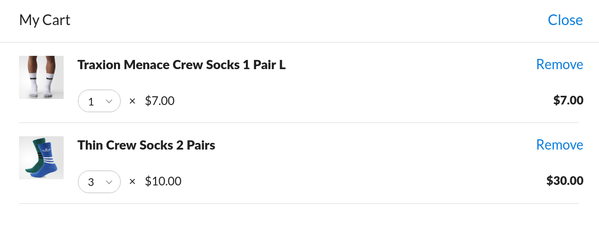
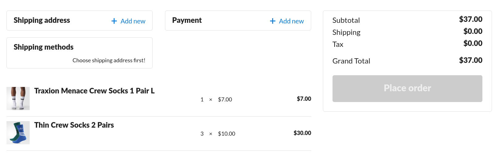
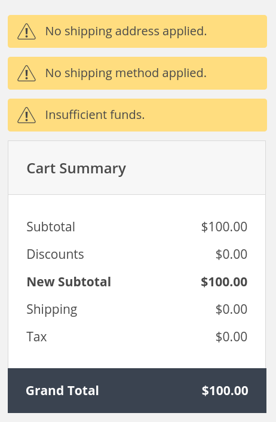

# Customers and Checkout Guide
--- row

<<< left
The Fox Platform has a fully functional Customer Management System including support
for guest and login accounts. 

This guide will introduce you to customer accounts and the checkout process.
By the end you should have an idea of what the checkout process looks like
and how you can structure your storefronts checkout code.
<<<

>>> right
<!-- include(../api-ref-snippet.md) -->
>>>

---

--- row

<<< left
## Signup
A Customer can either be a guest or have a login with a password. In terms of buying
products there are several advantages for customers having a login such as having access
to their address book and payment methods.



#### More about Accounts
::: note
[Create a guest account with an email](guest.html)
:::

::: note
[Register a customer with an email and password.](account.html)
:::

::: note
[Oauth with Google](google.html)
:::

<<<

>>> right

<br></br>
#### Registering a User

Signup will register a user and return the user information and a JWT authorization token.

``` javascript
var fox = new FoxApi();
fox.auth.signup('john@doe.com', 'John Doe', 'password')
    .then(({jwt, customer}) => {
        fox.addAuth(jwt);
        //do stuff with customer
    });
```

#### Guest

Guest accounts are automatically created if a user isn't logged in and touched
their cart. During checkout you want to set the users email.

``` javascript
fox.account.update({'foo@bar.com'});
```

>>>

---

--- row

<<< left
## Cart

A customer cart is stored server side so that they can access it from any device.
There is one cart per customer per channel. The cart is designed to support diverse
checkout flows and there is no particular order in preparing the cart for checkout.



#### More about Carts
::: note
[Create and manage a Cart](carts.html)
:::

<<<

>>> right

<br></br>
#### Getting The Cart
``` javascript
fox.cart.get().then( (cart) => {
    //do something with the cart like render it.
});
```

#### Adding Products
``` javascript
fox.cart.addSku('SKU-123', 10);
```

>>>

---

--- row

<<< left
## Checkout

Once a cart is in a good state, you can checkout to create an order.
The cart has a validator which returns errors about what information is missing
or incorrect to create an order



### Checkout Requirements
  - An email address
  - A Payment Method
  - A Shipping Address
  - A Shipping Method



::: note
These items can be provided in any order which allows diverse checkout flows.
:::

#### More about Checkout
::: note
[Checkout and Error Handling](checkout.html)
:::

<<<

>>> right

<br></br>
#### Adding a New Shipping Address
``` javascript
var address = {
    name: "John Doe",
    address1: "325 W Richmor",
    address2: "",
    city: "Seattle",
    phoneNumber: "6666666666",
    zip: 98109,
    regionId: regions["WA"],
    isDefault: false,
    country: 'United States'
};

fox.addresses.add(address).then((newAddress) => {
    fox.cart.setShippingAddressById(newAddress.id);
});
```

#### Adding a Credit Card
``` javascript
var stripe = Stripe('pk_test_6pRNASCoBOKtIshFeQd4XMUh');
stripe.tokens.create({
        card: {
        "name": "John Doe",
        "number": '4242424242424242',
        "exp_month": 12,
        "exp_year": 2018,
        "cvc": '123'
        }
}).then((token) => {;
    fox.creditCards.createCardFromStripeToken(token, address)
        .then((card) => {;
            fox.cart.addCreditCard(card.id);
        });
});
```

#### Completing Checkout
``` javascript
fox.cart.checkout().then((order) => {
    //Show customer order number and summary
});
```

>>>

---

--- row

<<< left
## Addresses
Accounts can have an address book which can have any number of addresses.
These addresses can be used for billing and shipping information. Setting a
default address is required for single click checkout.


#### More Address Books
::: note
[Managing the Address Book](address.html)
:::
<<<

>>> right

<br></br>
#### Getting Addresses

``` javascript
fox.addresses.list().then( (addresses) => {
    //do something with addresses such as choosing one during checkout.
});
```

>>>

---

--- row

<<< left
## Wallet
Accounts can also have a wallet which stores the customers credit card information.
Setting a default credit card is required for single click checkout.


#### More about Wallets
::: note
- [Managing the Wallet](wallet.html)
:::
<<<

>>> right

<br></br>
#### Fetching Cards

``` javascript
fox.creditCards.list().then( (cards) => {
    //do something with cards set as picking one during checkout.
});
```
>>>

---

<!-- include(../support.md) -->
