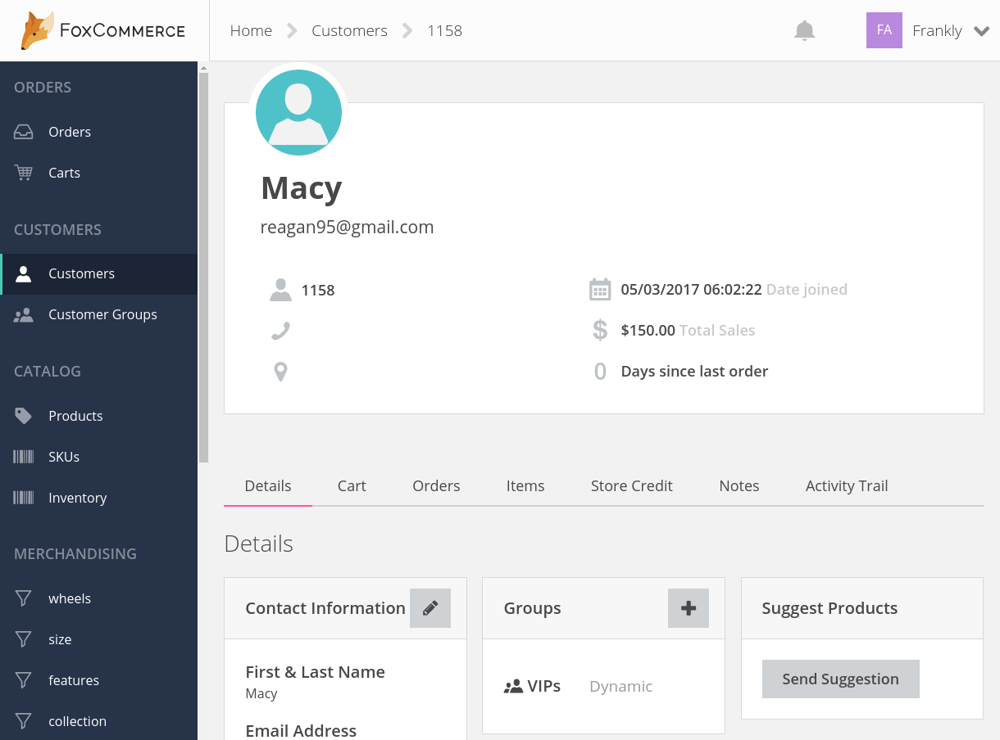
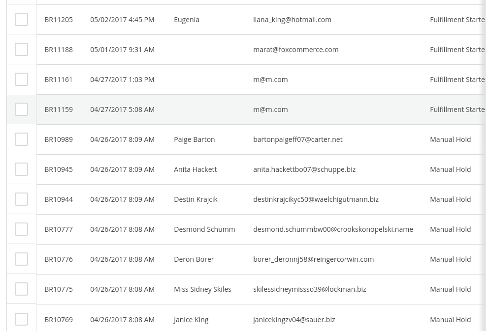
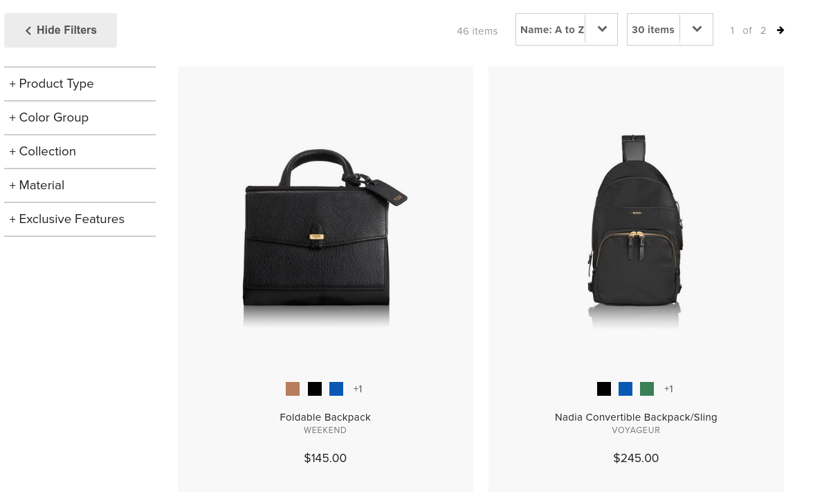
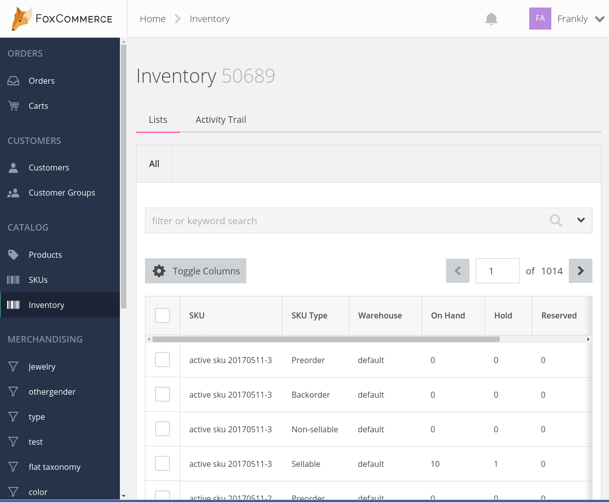
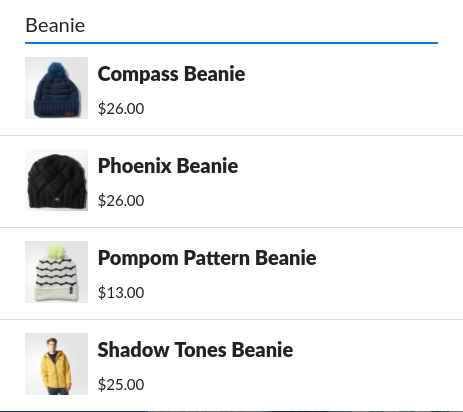
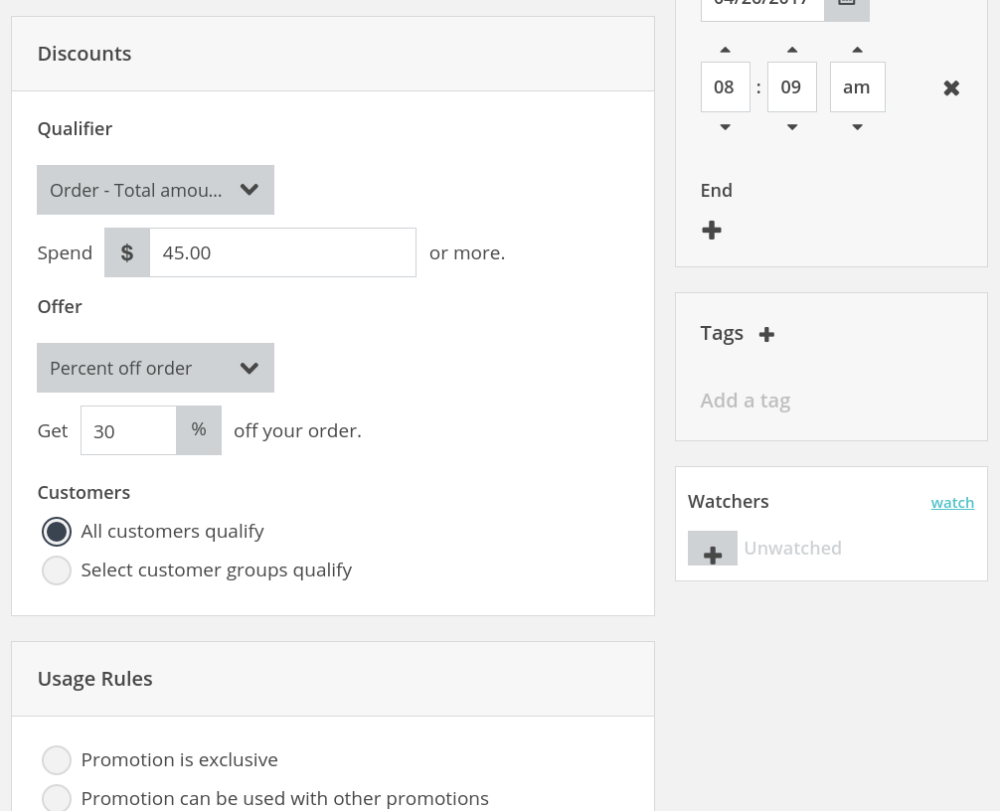
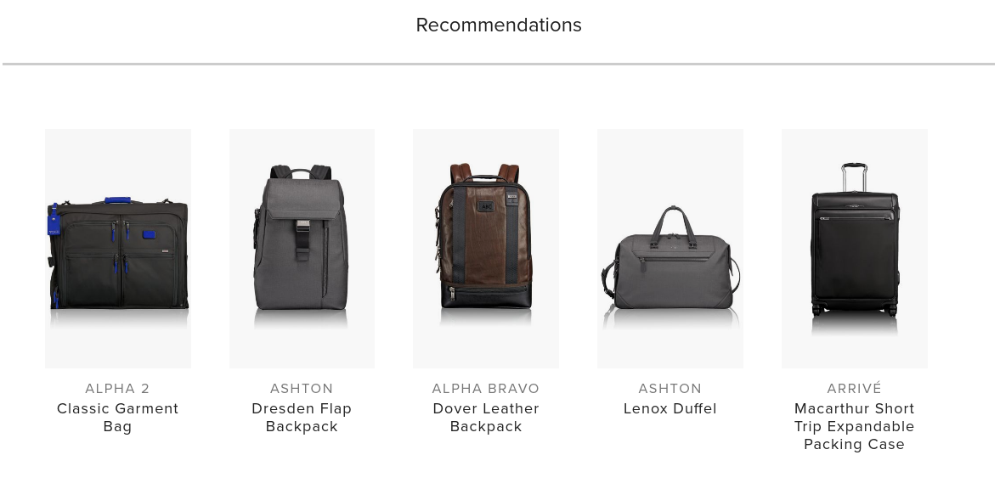
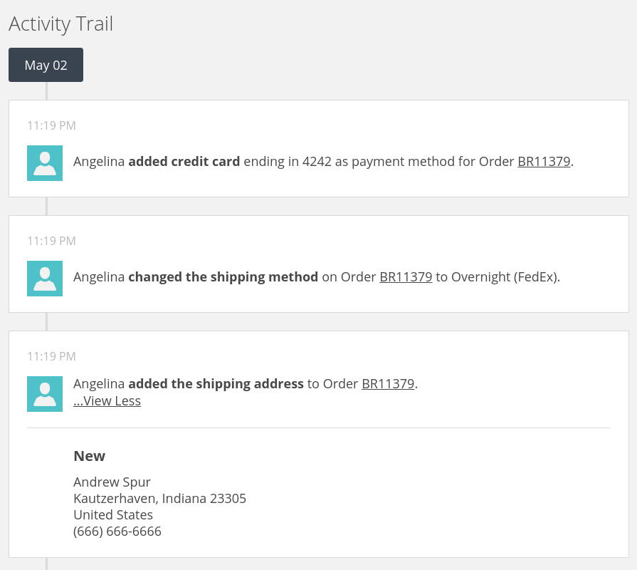

--- row

<<< left
# Welcome

Welcome to FoxCommerce! The Fox Platform is a large and diverse set of modern services
that allow you create next generation commerce experiences. 

<<<

>>> right

#### API Reference Quick Links
::: note
[Authentication](reference/index.html#header-authentication)
:::
::: note
[Errors](reference/index.html#header-errors)
:::
::: note
[API.js](https://github.com/FoxComm/api-js)
:::

>>>

---

--- row
<<< left
# [API Reference](reference/index.html)
See the API Reference for detailed information or the guides below for a tour
of FoxCommerce features.
<<<

---

--- row

<<< left
# Guides
## [Customers/Checkout Guide](customers/index.html)
Learn about customer accounts, registration, and checkout.


<<<

>>> right

<br></br>
#### Registering a User

Signup will register a user and return the user information and a JWT authorization token.

``` javascript
var fox = new FoxApi();
fox.auth.signup('john@doe.com', 'John Doe', 'password')
    .then(({jwt, customer}) => {
        fox.addAuth(jwt);
        //customers can also be guests.
    });
```
>>>

---

--- row

<<< left

## [Orders Guide](orders/index.html)
Learn how to manage orders and process orders.



<<<

>>> right

<br></br>
#### Getting An Order

``` javascript
fox.orders.get('BR42443').then((resp) => {
    var order = resp.result;
    var referenceNumber = order.referenceNumber;
    //orders are read only except order state.
});
```
>>>

---

--- row

<<< left
## [Products Guide](products/index.html)
Learn about products, variants, and SKUs.


<<<

>>> right

<br></br>
#### Getting a Product 

Along with the product id, you must specify which view you want.

``` javascript
fox.products.one('default',1343).then( (product) => {
    var title = product.attributes.title;
    //attributes are typed and customizable.
});
```
>>>

---

--- row

<<< left
## [Inventory Guide](inventory/index.html)

Learn about how to track inventory and make products available to customers.


<<<

---

--- row

<<< left
## [Search Guide](search/index.html)

Learn about searching products, customers, and orders. Learn how to create
search queries using the query language.


<<<

---

--- row

<<< left
## [Merchandising Guide](merchandising/index.html)

Learn about offering discounts and promotions to your customers to increase conversion.


<<<

---

--- row

<<< left

## [Personalization Guide](personalization/index.html)

Product recommendations, targeted messaging, and product reviews.



<<<

---

--- row

<<< left

## [Events Guide](events/index.html)

Understand and react to what is happening in the system.



<<<

---

--- row

<<< left

## [Extending Guide](extending/index.html)

Extending the storefront and back office. 


<<<

---

--- row

<<< left
## [Channels Guide](channels/index.html)

Learn about selling your products on amazon and managing orders.


<<<

---

<!-- include(support.md) -->
