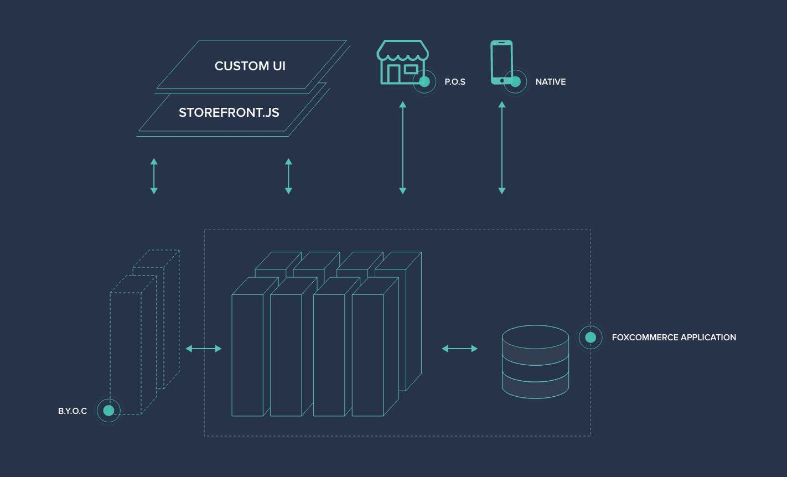

--- row

<<< left
# Welcome

Welcome to FoxCommerce! The Fox Platform is a large and diverse set of modern services
that allow you create next generation commerce experiences. 

Explore and get familiar with the different features of FoxCommerce:
<<<

>>> right
<!-- include(api-ref-snippet.md) -->
>>>

---

--- row

<<< left
## [Customers/Checkout Guide](customers/index.html)
Customers can be guests or have a login. Learn about customer accounts, carts, and the checkout process.


<<<

>>> right

<br></br>
#### Registering a User

Signup will register a user and return the user information and a JWT authorization token.

``` javascript
var fox = new FoxApi();
fox.auth.signup('john@doe.com', 'John Doe', 'password')
    .then(({jwt, customer}) => {
        fox.addAuth(jwt);
        //customers can also be guests.
    });
```
>>>

---

--- row

<<< left

## [Orders Guide](orders/index.html)
A full Order Management System is available that integrates with Inventory, Messaging, Returns.  Learn how to manage orders and order states.


<<<

>>> right

<br></br>
#### Getting An Order

``` javascript
fox.orders.get('BR42443').then((resp) => {
    var order = resp.result;
    var referenceNumber = order.referenceNumber;
    //orders are read only except order state.
});
```
>>>

---

--- row

<<< left
## [Products Guide](products/index.html)
Products, variants, and options.


<<<

>>> right

<br></br>
#### Getting a Product 

Along with the product id, you must specify which view you want.

``` javascript
fox.products.one('default',1343).then( (product) => {
    var title = product.attributes.title;
    //attributes are typed and customizable.
});
```
>>>

---

--- row

<<< left
## [Inventory Guide](inventory/index.html)

Track your inventory and make products available to customers.


<<<

---

--- row

<<< left
## [Search Guide](search/index.html)

Search indices and queries.


<<<

---

--- row

<<< left
## [Merchandising Guide](merchandising/index.html)

Offer discounts and promotions.


<<<

---

--- row

<<< left

## [Personalization Guide](personalization/index.html)

Product recommendations, targeted messaging, and product reviews.


<<<

---

--- row

<<< left

## [Events Guide](events/index.html)

Understand and react to what is happening in the system.


<<<

---

--- row

<<< left

## [Extending Guide](extending/index.html)

Extending the storefront and back office. 



<<<

---

--- row

<<< left
## [Channels Guide](channels/index.html)

Sell on Amazon.


<<<

---

<!-- include(support.md) -->
