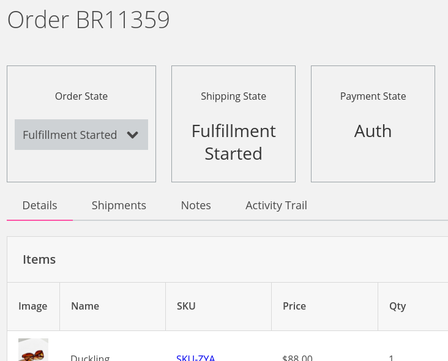
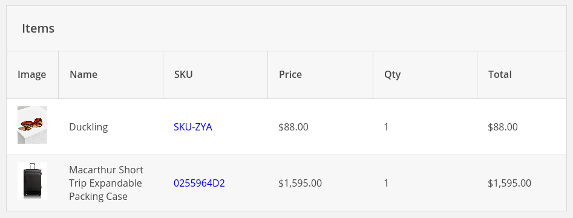
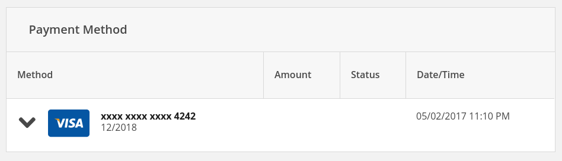

--- row

<<< left 

# Orders Guide

The Fox Platform has a fully functional Order Management System which integrates
with the inventory and catalog systems supporting various workflows via a 
rigorous state machine.

This guide will go over orders and give you an idea of what you can 
do with them.

<<<

>>> right
<!-- include(../api-ref-snippet.md) -->
>>>

---

--- row

<<< left
## Orders

Orders are created after a cart goes through the checkout operation. Orders are
read only except for their state which can go through several transitions.



When an Order is placed it gets put into a Remorse hold state. The Remorse Hold state
has a configurable timer which allows a customer to cancel an order before it goes
into a Fulfillment Started state.

#### More about Orders
::: note
[Understanding the Order States](states.html)
:::
<<<

>>> right

<br></br>
#### Getting An Order

``` javascript
fox.orders.get('BR42443').then((resp) => {
    var order = resp.result;
    var referenceNumber = order.referenceNumber;
    //do something with the order
});
```
>>>

---

--- row
<<< left 
## Line Items

Line Item are products the customer wants to purchase. Each line item has a reference and
optional metadata. If a promotion is applied to a cart, line items may also have matching
adjustments.



#### More about Line Items
::: note
[Reading Line Items From an Order](line-items.html)
:::
<<<

>>> right

<br></br>
#### Getting Line Items

``` javascript
fox.orders.get('BR42443').then((resp) => {
    var lineItems = resp.result.skus;
    //array that you can iterate.
});
```
>>>

---

--- row

<<< left
## Payment Methods

There is support for several payment methods including credit cards, store credit, and
gift cards.



#### More about Payment Methods
::: note
[Getting the Payment Method for an Order](payment-methods.html)
:::

<<<

>>> right

<br></br>
#### Getting Payment Methods

``` javascript
fox.orders.get('BR42443').then((resp) => {
    var paymentMethods = resp.result.paymentMethods;
    for(var i = 0; i < paymentMethods.length; i++) {
        var method = paymentMethods[i];
        var type = method.type;
        if(type == "creditCard") {
            var brand = method.brand;
            //...
        }
    }}
});
```
>>>

--- 

--- row

<<< left
## Billing and Shipping Addresses

A cart isn't valid until it has a billing and shipping address. These addresses
may be retrieved from a customers address book.

#### More about Addresses
::: note
[Reading the Billing and Shipping Address From an Order](addresses.html)
:::
<<<

>>> right

<br></br>
#### Getting Shipping Addresss

``` javascript
fox.orders.get('BR42443').then((resp) => {
    var shippinAddress = resp.result.shippinAddress;
    var city = shippinAddress.city;
    //...
});
```

#### Getting Billing Addresss

``` javascript
fox.orders.get('BR42443').then((resp) => {
    var billingAddress = resp.result.billingAddress;
    //billing address is the same structure as 
    //the shipping address.
});
```
>>>

---


<!-- include(../support.md) -->
