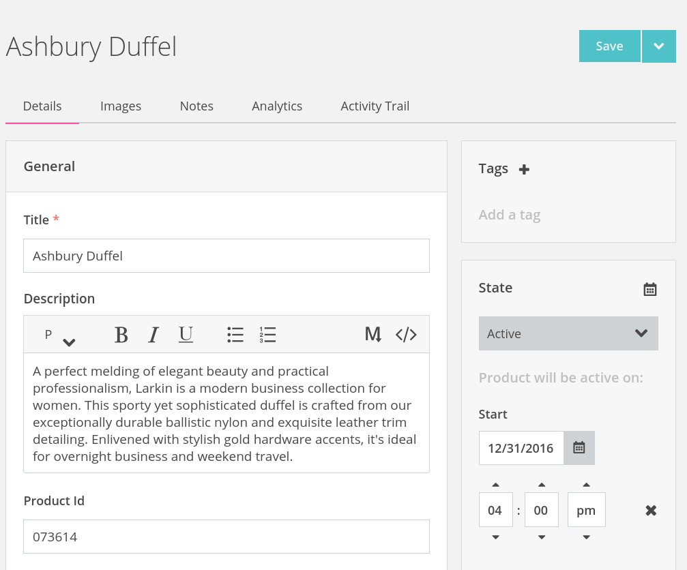
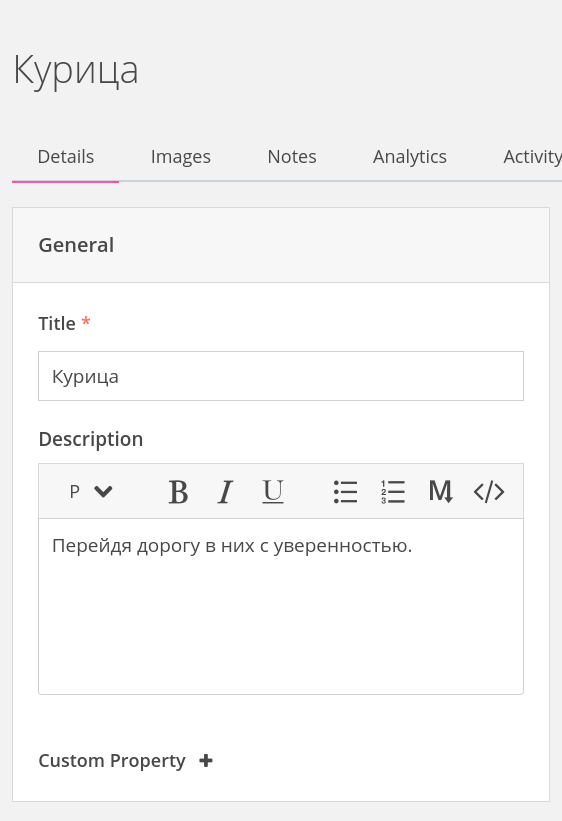
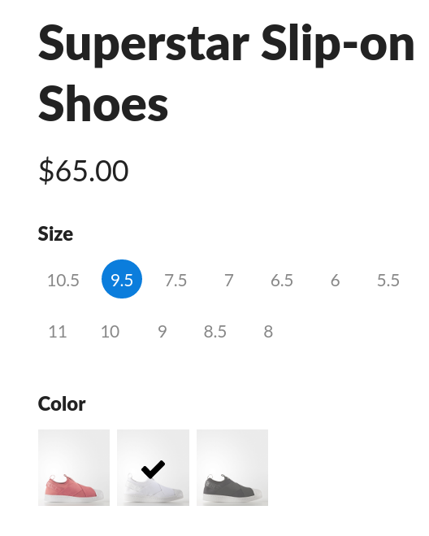
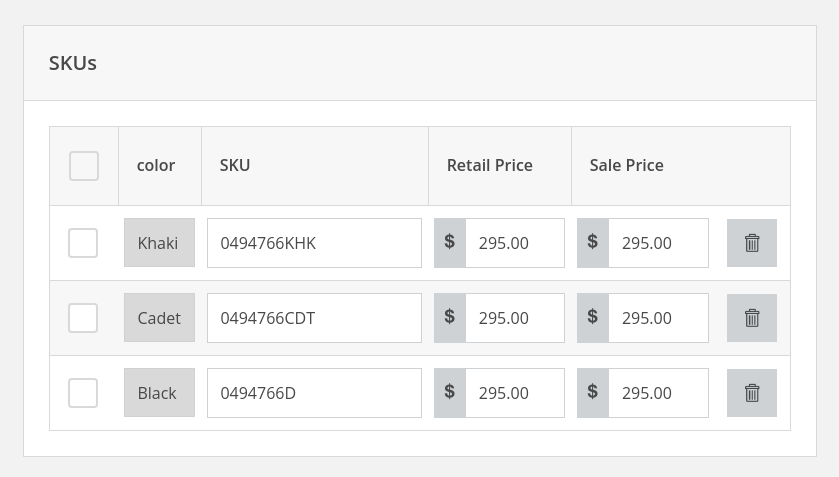

--- row

<<< left
# Products Guide

The Fox Platform has a very flexible product model which allows custom attributes and
different versions of the same product in difference channels.
<<<

>>> right
<!-- include(../api-ref-snippet.md) -->
>>>

---

--- row

<<< left
## Products

Products are a collection of one or more Stock Keeping Units (SKUs) along with merchandising information
such as a title, description, and images. If a product has many colors or sizes, 
you can add variants to the product and assign the SKUs to them. 



You can add any custom property to a product that you wish. 
All Product attributes have a type which can help the UI decide how to render
and manipulate the attribute.

<<<

>>> right

<br></br>
#### Getting a Product 

Along with the product id, you must specify which view you want.

``` javascript
fox.products.one('default',1343).then( (product) => {
    var title = product.attributes.title;
    //attributes have a type and a value in the 't' and 'v' 
    //keys.
});
```
>>>

---

--- row

<<< left
## Versions and Views
Updating a product creates a new version of that product with the same Identity.
The Fox Platform maintains a complete history of changes including creating new
versions for different storefronts.

We call these different versions **Views** of the product. Views enable great features
like internationalization, staging workflows, verification, storefront optimization
via Artificial Intelligence.



### Learn more about Products
::: note
[Creating a New Product](products.html)
:::
::: note
[Creating a New View of a Product](products.html)
:::
::: note
[Reverting to an Older Version](products.html)
:::

<<<

>>> right

<br></br>
#### Getting a Different View a Product 

Products can have multiple Views.

``` javascript
fox.products.one('russian',1343).then( (product) => {
    var title = product.attributes.title;
    //Will return the Russian version of the product.
    //...
});
```
>>>

---

--- row 

<<< left

## Variants

Variants are a specific variation of a product such as size and color.
They contain a list of values that have that variation. For example if the variant is
color then it may have several values such as "black", "white", etc.
Each value has a list of SKU codes that have that value of the particular variant.

Variants can be used in the storefront to provide the customer with a widget to 
select attributes like color and size.



### Learn more about Variants
::: note
[Create and Assign a Variant to a Product](variants.html)
:::

<<<

>>> right

<br></br>
#### Getting a Products Variants

``` javascript
fox.products.one('default',1343).then( (product) => {
    var variants = product.variants;
    for(var i = 0; i < variants.length; i++) {
        var variant = variants[i];
        var name = variant.attributes.name; //like 'color'
        
        //iterate through skus that have this variation
        for(var j = 0; j < variant.values.length; j++) {
            var value = variant.values[j];
            var name  = value.name; // like 'black'
            var skus = value.skuCodes;
            //...
        }
    }   
});
```
>>>

---

--- row 

<<< left

## Stock Keeping Unit (SKUs)

SKUs provide a way for a customer to select a product based on varying attributes such 
as size and color. Every combination of options is assigned a variant.



::: note
A product's SKUs should be assigned to variants for customer
to be able to purchase.
:::

### Learn more about SKUs
::: note
[Assigning SKUs to Variants](skus.html)
:::

<<<

>>> right

<br></br>
#### Listing a Products SKUs

``` javascript
fox.products.one('default',1343).then( (product) => {
    var skus = product.skus;
    for(var i = 0; i < skus.length; i++) {
        var sku = skus[i];
        var code = sku.attributes.code;
        var name = sku.attributes.name;
        //...
    }
});
```
>>>

---

<!-- include(../support.md) -->
